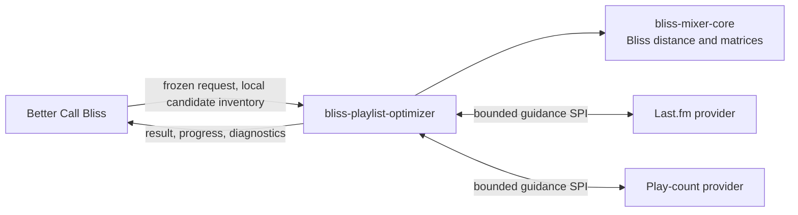

# bliss-playlist-optimizer

`bliss-playlist-optimizer` is the network-free Rust engine that turns a frozen
Lyrion playlist or queue request into an auditable Bliss-first result. It is
used by [Better Call Bliss](https://github.com/chrober/lms-better-call-bliss).

It exists because contextual scoring and route search across large analyzed
libraries belong in a native process, not in the Lyrion plugin's Perl request
path. It uses [`bliss-mixer-core`](https://github.com/chrober/bliss-mixer-core)
for the same Bliss feature-distance behavior used by the mixer ecosystem.

## What it does

- Reorders a fixed set of local tracks.
- Adds Bliss-qualified tracks to extend a playlist or satisfy repeat windows.
- Builds one-way and round-trip routes to a selected track or album.
- Finds and evaluates bridges for difficult playlist transitions.
- Applies repeat, genre, virtual-library, membership, and route constraints.
- Produces deterministic results for the same request, artifacts, and seed.
- Emits a result artifact and optional progress/timing sidecars.

It does **not** contact Last.fm, talk to LMS, change `bliss.db`, or persist a
playlist or player queue. Those integration responsibilities belong to Better
Call Bliss.



## Related repositories

| Component | Responsibility |
| --- | --- |
| [Better Call Bliss](https://github.com/chrober/lms-better-call-bliss) | Lyrion UI, request capture, LastMix acquisition, preview, reporting, and persistence. |
| [Guidance SPI](https://github.com/chrober/bliss-playlist-guidance-spi) | Host-neutral JSONL contract for optional candidate guidance. |
| [Last.fm guidance](https://github.com/chrober/bliss-guidance-lastfm) | Consumes Better Call Bliss's frozen, resolved Last.fm artifact. |
| [Play-count guidance](https://github.com/chrober/bliss-guidance-playcounts) | Reads a trusted, read-only Lyrion `persist.db` snapshot. |
| [bliss-mixer-core](https://github.com/chrober/bliss-mixer-core) | Shared Bliss scoring and matrix behavior. |

Guidance is advisory: it can boost or de-boost a candidate only after the
optimizer has admitted it acoustically and all hard constraints pass.

## Common commands

```text
cargo run -- version --json
cargo run -- validate --request examples/reorder-only-request.json
cargo run -- route --request fixtures/synthetic/adaptive-scoring-request.json
cargo run -- bridge --request fixtures/synthetic/automatic-bridge-request.json
```

Production integrations use `route` or `bridge` with a request artifact and may
add `--progress`, `--timings`, and a decoded-library `--cache-dir`. See the
[architecture reference](docs/ARCHITECTURE.md) for the full contract, security
boundary, modes, diagnostics, cache, parallelism, and release details.

## Development

```text
cargo fmt -- --check
cargo clippy --all-targets --all-features -- -D warnings
cargo test --all-features
```

See [CONTRIBUTING.md](CONTRIBUTING.md), [error codes](docs/ERROR_CODES.md), and
the [synthetic fixtures](fixtures/synthetic/README.md) for contributor detail.
